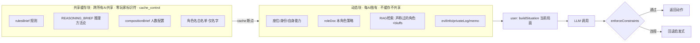

## 用户需求

优化《血染钟楼》AI 玩家的上下文构造：目前每次决策都把整套剧本（约 24 个角色的能力，约 1500+ token）和规则、推理方法论全部塞进系统提示重复发送，既浪费 token 又容易让模型张冠李戴产生幻觉。用户希望引入 RAG 与缓存等机制，只给 AI 看当前推理真正需要的内容，让 AI 更聪明、更少幻觉、更省成本。

## 核心特性

- 将系统提示拆分为「剧本级公共缓存块」与「玩家专属动态块」：缓存块只含规则书、推理方法论、人数配置、角色名白名单，严格零玩家标识符；玩家身份、自身能力、角色策略、私密信息、邪恶情报、RAG 检索到的相关角色能力全部放在缓存断点之后，永不跨玩家共享。
- 公共缓存块加 `cache_control:{type:"ephemeral"}` 断点（MiniMax Anthropic 兼容主动缓存，读取成本仅 10%，5 分钟 TTL 命中刷新），一局内所有 AI 的所有调用命中同一份缓存。
- 角色能力改为 RAG 选择性注入：仅注入「自己角色 + 公开发言中别人声称过的角色（复用现有正则提取，已过滤私聊）+ 邪恶伪装池」，完整能力表移出系统提示，仅留角色名白名单做假名检测。
- 新增 `assertNoLeak` 自动化断言，防止日后有人把玩家信息误写进共享缓存块。
- 抽离统一代码层约束校验 `enforceConstraints`，杜绝「选死者 / 投自己 / 阵营不自洽」等规则幻觉，违规即回退启发式。

## 技术栈

- 沿用现有栈：Vite + React（前端），MiniMax-M3 经 Anthropic 兼容协议经 `api/minimax.js` 代理转发；JS（ESM）。
- 不引入新依赖、不引入向量数据库（剧本数据是内存确定性数据，程序化选择性注入即足够，避免过度设计）。

## 实现策略

核心思路：在「零语义损失、严守 playerView 安全不变量」前提下，分三步降本提智——① Prompt Caching（收益最大、风险最低）→ ② RAG 角色检索 → ③ 代码层约束校验兜底。

关键决策与权衡：

1. **缓存边界 = 安全边界**：共享缓存块严格只含脚本级公共内容（`rulesBrief`、`REASONING_BRIEF`、`compositionBrief`、角色名白名单），不含任何 `view.seat`/`view.name`/`view.you`/角色分配。这样前缀对所有 AI 完全相同 → 跨 AI 共享一份缓存（省得最多），且从架构上杜绝串号作弊。此边界用 `assertNoLeak` 在测试期强制校验。
2. **角色策略 `roleDoc(you.role)` 属秘密**，留在动态块（每个 AI 只拿到自己角色的玩法），不进缓存。
3. **RAG 检索入口复用 `buildClaimAudit` 的发言正则提取**（已用 `c.to==null` 过滤私聊），只取「自己角色 + 声称过的角色 + bluffs」，把全角色表从 ~24 条降到 3~6 条。顺带减少幻觉：模型不再能拿错角色能力。
4. **共享块需 ≥1024 token 才触发缓存**（MiniMax 阈值），`rulesBrief+REASONING_BRIEF+compositionBrief` 通常满足，用返回 `cache_creation_input_tokens>0` 与 `cache_read_input_tokens` 验证。
5. **代理 `api/minimax.js` 仅透传 body，无需改动**；只改前端 `llm.js` 把 system 由字符串改为数组并加 `cache_control`、解析 `usage`。

性能与可靠性：系统提示此前逐字重复发送（一局约 210 次 AI 调用，system 占输入近半且全重复）。加缓存后该部分成本降至 10%，整体输入成本约降 50%~70%，并降低首 token 延迟（免去重复 prefill）。RAG 进一步缩减动态块体积。所有改动不影响现有启发式回退与预算分层。

## 实现要点

- `buildSystemPrompt` 改为返回「块数组」而非单一字符串：前块共享静态（带 `cache_control`），后块玩家动态。
- `stageAdvice(view)` 依赖天数/存活数，属随回合变化内容，必须留在动态块，否则破坏缓存前缀。
- RAG 检索需要的 `chatHistory` 须透传到动态块构建函数；共享块保持纯静态、不依赖 `chatHistory`。
- `assertNoLeak(sharedText, view)` 检查共享块文本是否命中玩家名、座位号、`你是`、`你的身份`、`你的能力`、`私密`、`邪恶阵营情报` 等禁用词，命中即抛错。
- `enforceConstraints(action, view)` 统一校验夜行动/投票/提名的目标合法性（存活、非己、阵营自洽），违规回退启发式——此逻辑从 `decideNightAction` 等方法中抽离复用。

## 架构设计



## 目录结构与改动文件

```
newVersion/
├── src/ai/
│   ├── prompts.js          # [MODIFY] 拆分 buildSystemPrompt → buildSharedSystemBlocks()(公共,带assertNoLeak) + buildPlayerSystemBlocks()(秘密,动态,含RAG检索); scriptRolesBrief 改为 scriptRoleNameWhitelist + scriptRolesBriefRAG(chatHistory); 新增 assertNoLeak
│   ├── llm.js              # [MODIFY] anthropicRequest 将 system 改为数组并给共享块加 cache_control:{type:ephemeral}; 解析并返回 usage.cache_creation_input_tokens / cache_read_input_tokens 供监控
│   └── aiController.js     # [MODIFY] _ask 适配 system 块数组; 新增 enforceConstraints(action,view) 统一约束校验,在所有决策方法里复用
├── api/minimax.js          # [NO CHANGE] 已确认仅透传 body,无需改动
└── test/
    └── prompt-cache.test.js # [NEW] 断言: 共享缓存块不含任何玩家标识符(assertNoLeak); 构造多玩家 system 验证前缀一致可共享; 验证 RAG 只注入相关角色
```

## 关键代码结构

```javascript
// prompts.js —— 系统提示分块契约
export function buildSharedSystemBlocks(view) {        // 纯剧本级公共内容, 零玩家标识符
  return [{ type: "text", text: ..., cache_control: { type: "ephemeral" } }];
}
export function buildPlayerSystemBlocks(view, persona, memo, chatHistory) { // 玩家秘密 + RAG
  return [{ type: "text", text: ... }];
}

// prompts.js —— 共享块防泄露断言
export function assertNoLeak(sharedText, view) {
  const forbidden = [...view.seats.map(s => s.name), ...view.seats.map(s => `${seatNo(s.seat)}号`), view.you.roleName, "你是", "你的身份", "你的能力", "私密", "邪恶阵营情报"];
  const hit = forbidden.find(f => f && sharedText.includes(f));
  if (hit) throw new Error(`共享缓存块泄露玩家信息: 命中「${hit}」`);
}

// llm.js —— 缓存用量透出
// anthropicRequest 返回的 usage 需包含 cache_creation_input_tokens / cache_read_input_tokens
```